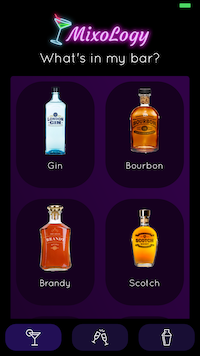

<h1 align="center">Welcome to MixoLogy Mobile App 👋</h1>
<p>
  
  <a href="https://twitter.com/jenlooper">
    
  </a>
</p>

> Scan bottles from your minibar, get recipe suggestions. Shake your phone to get random RNN-generated fake cocktails



## Install

```sh
npm i
```

## Usage

```sh
tns run ios or tns run android
```

## Author

👤 **Jen Looper**

-   Twitter: [@jenlooper](https://twitter.com/jenlooper)
-   Github: [@jlooper](https://github.com/jlooper)

## Show your support

Give a ⭐️ if this project helped you!

---

_This README was generated with ❤️ by [readme-md-generator](https://github.com/kefranabg/readme-md-generator)_
